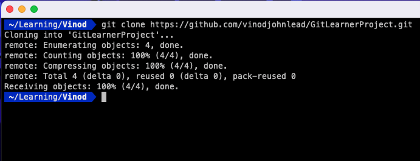
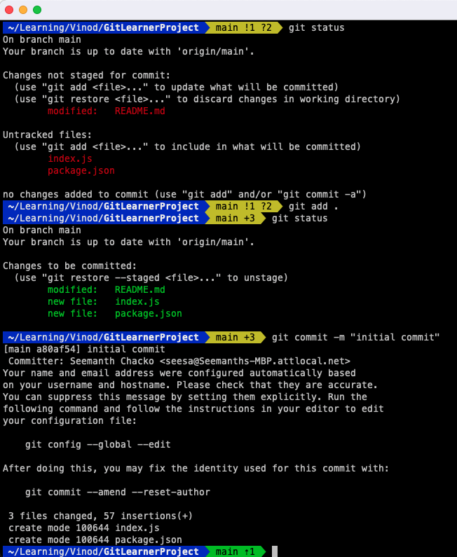
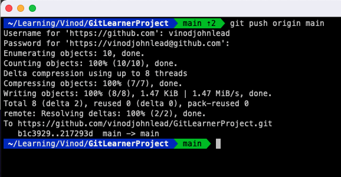
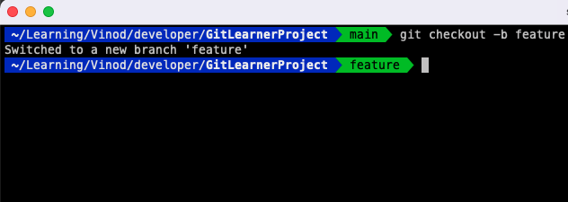
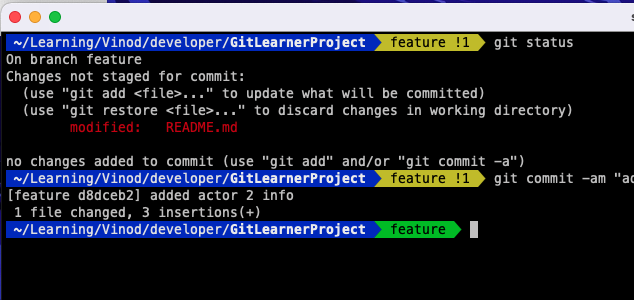
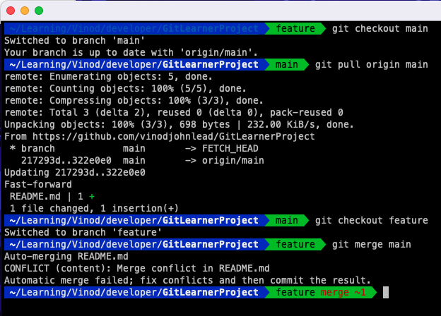
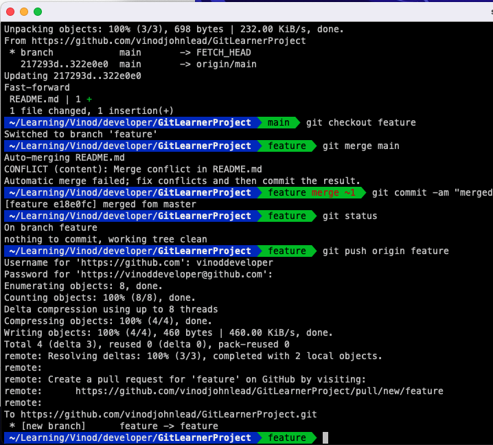
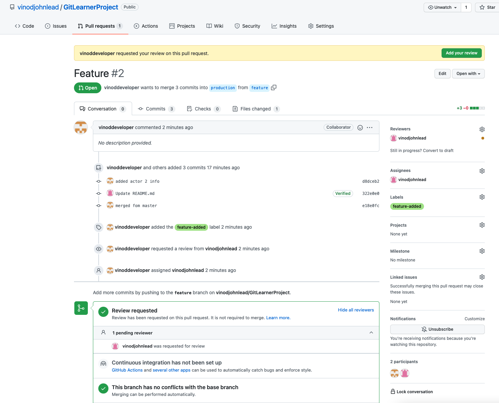
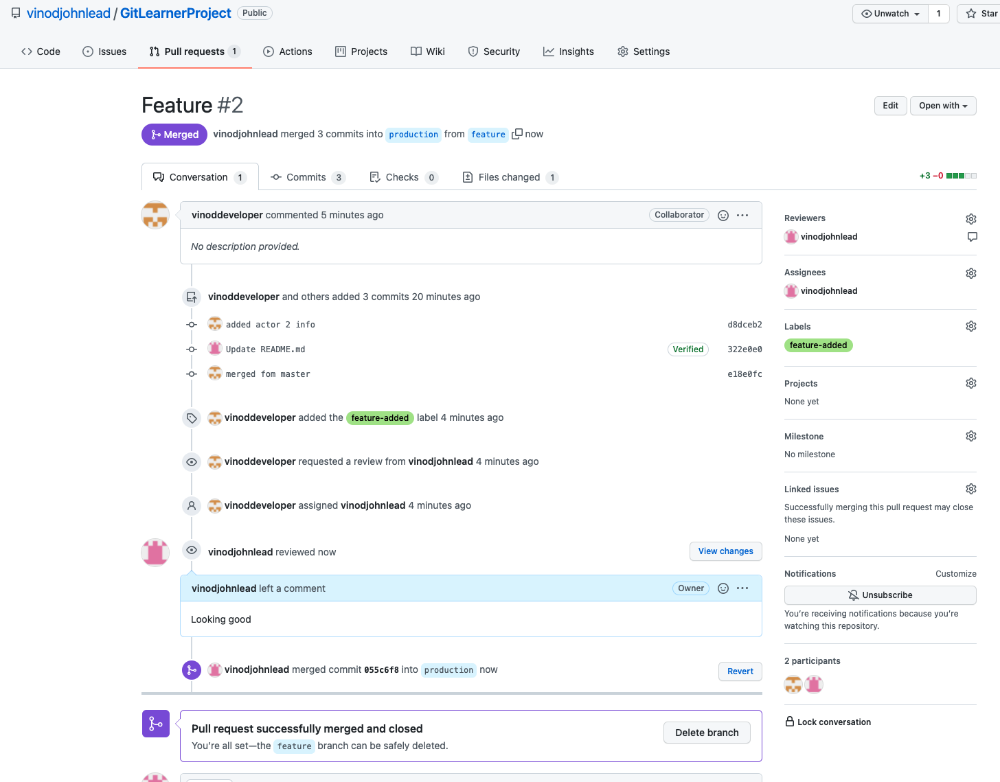

# GitLearnerProject
Project Setup to showcase git workflow

## Actors

### Actor 1
  - Role: Manager
  - Name: Vinod Lead
  - Email: vinodjohn.lead@gmail.com
  - Gitlab Account: 
    - username: vinodjohnlead
### Actor 2
  - Role: collaborator
  - Name: Vinod Developer
  - Email: vinoddeveloper@yahoo.com
  - Gitlab Account: 
    - username: vinoddeveloper

### Gitlab Repo
  - Name: GitLearnerProject
  - Branches: Main and feature

### Tasks
  - Manager clone project locally
  - Update Readme file and add initial version to main branch
  - Commit and push to remote repo on Gitlab
  - Developer clone project locally
  - Create feature branch and make changes locally
  - Manager makes a change and update remote main branch.
  - Developer pull changes in main branch locally.
  - Developer merges changes in main branch to feature branch.
  - Developer resolves merge conflicts.
  - Developer does add, commit and push feature branch.
  - Developer creates pull request to merge changes to production branch.
  - Manager reviews and approves pull request and merges its.
  - Manager creates a release tag from production branch
  - Manager merges production branch to main

### Workflow Screenshots

1. Lead clones repo locally  

   

1. Lead makes changes and does `git add` and `git commit` to `main` branch  

    

1. Lead pushes main branch  

   

1. Developer clones repo and creates `feature` branch  

   

1. Developer makes changes and commits locally to feature branch.  

   

1. Developer pulls changes from `main` branch and merges it to `feature` branch and resolves merge conflict  

   

1. Developer pushes `feature` branch and creates pull request  

   

1. Lead does pull request review  

   

1. Lead merges pull request  

   
